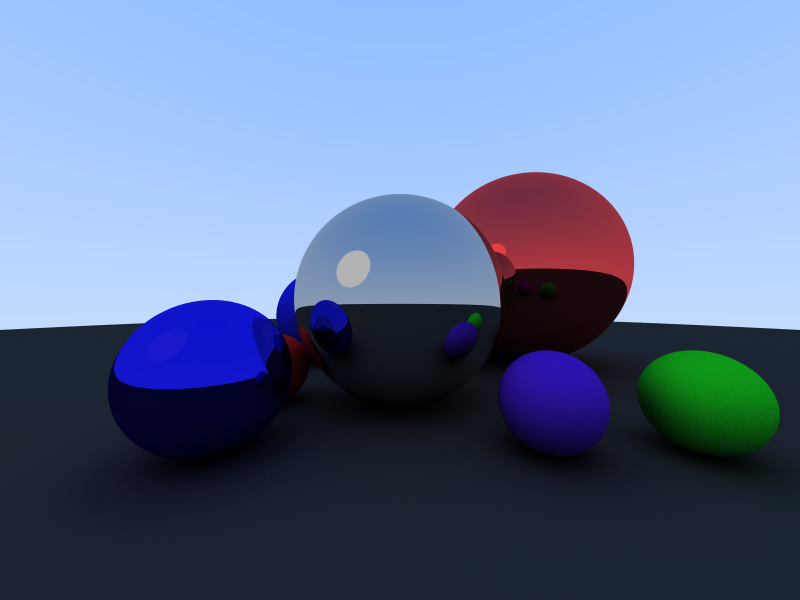
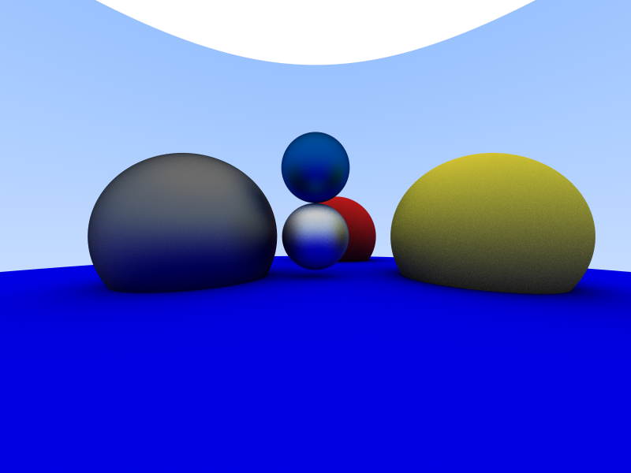
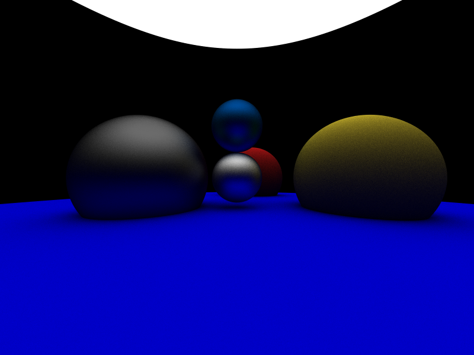

# Ray Tracer
Ray Tracer in C++ using [**raylib**](https://www.raylib.com/).

Made by [**Maxime Houis**](https://github.com/MaximeHouis) and [**Pierre Langlois**](https://github.com/Perzi-Lgs).

### Screenshots

*Images generated with an anti-aliasing of x512.*







### Build
```console
./configure [Debug/Release]
./CI/build [Debug/Release]
# or
./CI/all [Debug/Release]
```

### Usage

```
USAGE
	./RayTracer (--file/-f) path_to_scene [OPTIONS...]

OPTIONS
	--file, -f    * Open scene file (json format)
	--fullscreen    Run app in fullscreen
	--dark          Enable dark mode
	--width, -w   X Set window's width in pixels
	--height, -h  X Set window's height in pixels
	--fps         X Set application max FPS
	--aa, -a      X Set the anti-aliasing level

* Mandatory
X Optional, requires a value (e.g.: --fps 144)
```

